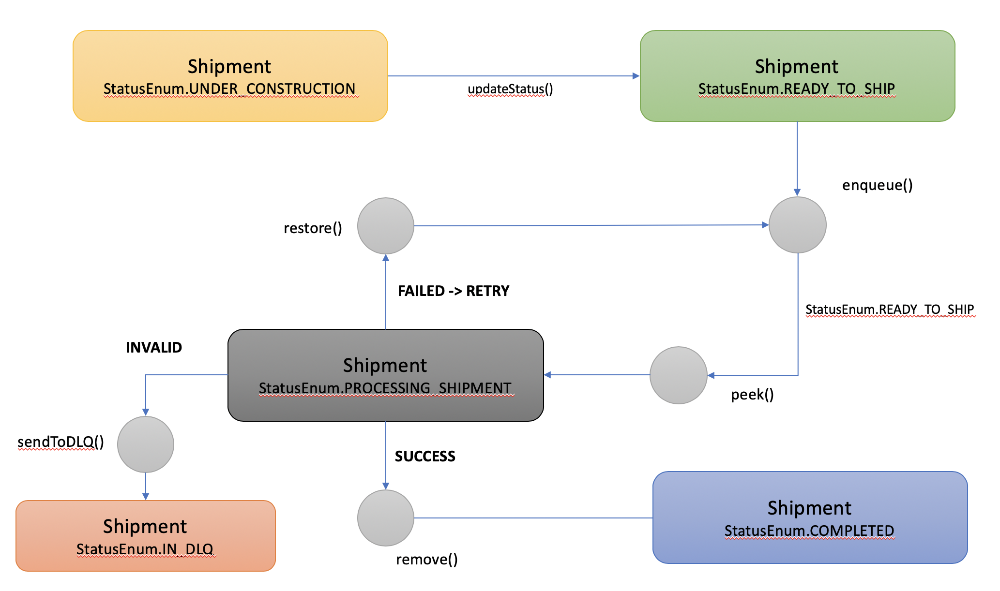

## Amazon Dynamodb Implementing Priority Queuing

Implementing Priority Queuing with Amazon DynamoDB

## License Summary

This sample code is made available under the MIT-0 license. See the LICENSE file.

## Quick start

1) Generate DynamoDB table using the CloudFromation script, as [shown below](#cdk)

Example:
aws cloudformation create-stack --stack-name q-ddb-stack --template-body file://aws-blog-queue-dynamodb-stack.template.json

2) Build your Java code

In the root of the project, type on the terminal: mvn clean install

Above command should build a JAR in the /target folder.

3) Start our own CLI using [Java JAR command](#cli)

Example:
java -cp awsblog-queueing-1.0.0.jar com.awsblog.queueing.cli.CLI --profile=default --region=us-east-1
 
4) Run Shipment & Queue simulation: follow the [test script](#how-to-test?) 

## Build your infrastructure 

There are several ways to build necessary infrastructure to showcase queuing concepts. 

<a name="cdk"></a>
a) Using Cloud Formation script to build the dynamoDB table 

There is a `aws-blog-queue-dynamodb-stack.template.json` at the root of the project. Run the following AWS CLI command:

```
aws cloudformation create-stack --stack-name q-ddb-stack --template-body file://aws-blog-queue-dynamodb-stack.template.json 
```

Above script will generate required DynamoDB table.

b) Run CDK (we have used 1.11.DevPreview release of the Java CDK)

In order to run the sample code, we have created a CDK code to build your infrastructure in AWS. Running CDK 
CLI you will create a DynamoDB example table.

To install the Command Line Interface (CLI) CDK, please follow CDK installation instructions, found at:

https://docs.aws.amazon.com/cdk/latest/guide/getting_started.html

Once you have install the prerequisites, start your terminal and navigate to the root 
of our AWS Blog project. You should see the `pom.xml` and `cdk.json` in the root of the 
project directory.

Run the following commands:

```
    mvn clean compile
    
            cdk --profile <your-aws-credentials-profile-name> 
                    --context instance-name=<Choose your instance name>]
                    --context aws-region=<AWS Region name> 
                    --context aws-credentials-profile=<your-aws-credentials-profile-name>                   
                     deploy '*'
```    

example:

```    
    cdk --profile default --verbose true --context aws-region=us-east-1 --context aws-credentials-profile=default deploy '*'

```

Current DynamoDB table name is: `AWSBlog-shipment-demo`. If you want to change it, make sure that this needs to be changed in the 2 places:
- `aws-blog-queue-dynamodb-stack.template.json`
- `configuration.json`

## SDK

Our project contains a SDK that supports all key queuing commands addressed in the Blog Post.

All of those commands are show cased within `com.awsblog.queueing.test` package.

Simple example:

``` \java
		String ID = "A-101";
		ShipmentData data = new ShipmentData(ID);
		data.setData1("Data 1"); data.setData2("Data 2"); data.setData3("Data 3");
		data.setItems(Arrays.asList(new ShipmentItem("Item-1", true), new ShipmentItem("Item-2", false)));
		
		Shipment shipment = new Shipment();
		shipment.setId(ID);		
		shipment.setData(data);
		
		// create a SDK client
		QueueSdkClient client = new QueueSdkClient.Builder()
									.withCredentialsProfileName("default")
									.withRegion("us-east-1").build();
									
		// store shipment record in the DynamoDB table
		client.put(shipment);
		
		QueueStats queueStats = client.getQueueStats();
		System.out.println(Utils.toJSON(queueStats));

		// use SDK's get() method
		Shipment retrievedShipment = client.get("A-101");
		System.out.println(Utils.toJSON(retrievedShipment));
		
		// send the record to the queue
		EnqueueResult result = client.enqueue("A-101");
		System.out.println(Utils.toJSON(result));
		
		if (!result.isSuccessful()) {
			
			// in case it failed, change the status and try it again
			client.updateStatus("A-101", StatusEnum.READY_TO_SHIP);
			client.enqueue("A-101");
		}
		
		Shipment enqueuedShipment = result.getShipment();
		System.out.println(Utils.toJSON(enqueuedShipment));

		queueStats = client.getQueueStats();
		System.out.println(Utils.toJSON(queueStats));
		
		// Retrieve the record from the queue
		PeekResult peek = client.peek();
		System.out.println(Utils.toJSON(peek.getPeekedShipmentId()));
```

## CLI

### Overview

CLI is a Java based utility that provides a Command Line Interface to number of methods 
related to this AWS Blog Post project. The tool is a great educational system to better understand how queue implementation works on DynamoDB.

<a name="cli"></a>
### Getting Started with CLI

In order to use CLI from the terminal, go to the folder: `./<root-folder>/target/`

In order to start your CLI session you'll have two different options to invoke your session. 

- Option 1: Invoke the CLI with `--profile` and `--region` command line parameters 
- Option 2: Start CLI without initially connected to AWS; at later time, user can use CLI 'aws' command to connect to AWS.

To start your interactive CLI, run the following command:

```
java -cp awsblog-queueing-1.0.0.jar com.awsblog.queueing.cli.CLI [--profile=<AWS credentials profile name>] [--region=<AWS region>>]
```

Example:

```
java -cp awsblog-queueing-1.0.0.jar com.awsblog.queueing.cli.CLI --profile=default --region=us-east-1
```

### User guide

Once CLI is running, enter `h` or `?` to obtain the help:

```\java
===========================================================
>> Welcome to Queueing AWS Blog Post's CLI Tool!
===========================================================
 for help, enter one of the following: ? or h or help
 all commands in CLIs need to be typed in lowercase
 current directory is: [/Users/xyz/Projects/AWSBlogPostQueueing/.]
 ... AWS session is properly established!

 >> Enter command: ?
  ... this is CLI HELP!
    > aws <profile> [<region>]                      [Establish connection with AWS; Default profile name: `default` and region: `us-east-1`]
    > qstat | qstats                                [Retrieves the Queue statistics (no need to be in App mode)]
    > dlq                                           [Retrieves the Dead Letter Queue (DLQ) statistics]
    > create-test | ct                              [Create test Shipment records in DynamoDB: A-101, A-202, A-303 and A-404; if already exists, it will overwrite it]
    > purge                                         [It will remove all test data from DynamoDB]
    > ls                                            [List all shipment IDs ... max 10 elements]
    > id <id>                                       [Get the application object from DynamoDB by app domain ID; CLI is in the app mode, from that point on]
      > sys                                         [Show system info data in a JSON format]
      > data                                        [Print the data as JSON for the current shipment record]
      > info                                        [Print all info regarding Shipment record: system_info and data as JSON]
      > update <new Shipment status>                [Update Shipment status .. e.g.: from UNDER_CONSTRUCTION to READY_TO_SHIP]
      > reset                                       [Reset the system info of the current shipment record]
      > ready                                       [Make the record ready for the shipment]
      > enqueue | en                                [Enqueue current ID]
      > peek                                        [Peek the Shipment from the Queue .. it will replace the current ID with the peeked one]
      > done                                        [Simulate successful record processing completion ... remove from the queue]
      > fail                                        [Simulate failed record's processing ... put back to the queue; needs to be peeked again]
      > invalid                                     [Remove record from the regular queue to dead letter queue (DLQ) for manual fix]
    > id                                            [Reverting back to the standard CLI's system operational mode]

 >> Enter command: 
```

At the start, you are in the `standard` CLI mode. Here you can do check the queue or create the test data.  

When entering `id <shipment-app-id>` you are in the CLI's App Shipment mode, wher you can do 
various operation on the selected shipment record. ID information will be displayed 
at the CLI's command prompt.

Example:

```
>> Enter command: aws default us-east-1
 ... AWS session is properly established!

 >> Enter command: id A-101
     Shipment's [A-101] record dump
{
  "id" : "A-101",
  "data" : {
    "id" : "A-101",
    "items" : [ {
      "SKU" : "Item-1",
      "is_packed" : true
    }, {
      "SKU" : "Item-2",
      "is_packed" : false
    } ],
    "data_element_1" : "Data 1",
    "data_element_2" : "Data 2",
    "data_element_3" : "Data 3"
  },
  "system_info" : {
    "id" : "A-101",
    "creation_timestamp" : "2019-08-07T17:56:13.644Z",
    "last_updated_timestamp" : "2019-08-07T20:46:01.160Z",
    "status" : "PROCESSING_SHIPMENT",
    "version" : 13,
    "queued" : false,
    "queue_selected" : false,
    "queue_add_timestamp" : "2019-08-07T17:56:13.932Z",
    "queue_peek_timestamp" : "2019-08-07T20:46:00.958Z",
    "queue_remove_timestamp" : "2019-08-07T20:46:01.160Z"
  }
}
ID <A-101> >> Enter command: 
```

<a name="how-to-test?"></a>
## How to test?

To start, crate test records.

Run the following CLI command:

```
	 >> Enter command: ct
      >> Creating shipment with ID : A-101
      >> Creating shipment with ID : A-202
      >> Creating shipment with ID : A-303
      >> Creating shipment with ID : A-404
```

Above command has created 4 records, all with `UNDER_CONSTRUCTION` status. 

List shipment records (10 records only), not in any specific order:

```
>> Enter command: ls
     List of first 10 IDs:
      >> ID : A-101 - status: UNDER_CONSTRUCTION
      >> ID : A-202 - status: UNDER_CONSTRUCTION
      >> ID : A-303 - status: UNDER_CONSTRUCTION
      >> ID : A-404 - status: UNDER_CONSTRUCTION
```

Make the A-101 a current record:

```
 >> Enter command: id A-101
     Shipment's [A-101] record dump
{
  "id" : "A-101",
  "data" : {
    "id" : "A-101",
    "items" : [ {
      "SKU" : "Item-1",
      "is_packed" : true
    }, {
      "SKU" : "Item-2",
      "is_packed" : true
    }, {
      "SKU" : "Item-3",
      "is_packed" : true
    } ],
    "data_element_1" : "Data 1",
    "data_element_2" : "Data 2",
    "data_element_3" : "Data 3"
  },
  "system_info" : {
    "id" : "A-101",
    "creation_timestamp" : "2019-10-07T19:30:41.974Z",
    "last_updated_timestamp" : "2019-10-07T19:30:41.974Z",
    "status" : "UNDER_CONSTRUCTION",
    "version" : 1,
    "queued" : false,
    "queue_selected" : false
  }
}
```

We'll follow the status transition chart:



Display system_info for the current ID:

```
ID <A-101> >> Enter command: sys
     ID's system info:
{
    "id" : "A-101",
    "creation_timestamp" : "2019-10-07T19:30:41.974Z",
    "last_updated_timestamp" : "2019-10-07T19:30:41.974Z",
    "status" : "UNDER_CONSTRUCTION",
    "version" : 1,
    "queued" : false,
    "queue_selected" : false
}
```
Simulate the event when the record is finally ready for shipment. We'll use CLI's command `enqueue` or `en` to mark the record as ready to be shipped. The record will be placed in the queue.

Behind the scene, CLI is marking the record as `READY_TO_SHIP` and it is calling SDK's `enqueue(id)` method.

```
ID <A-101> >> Enter command: en
     Record's system info:
{
  "id" : "A-101",
  "creation_timestamp" : "2019-10-07T19:42:13.154Z",
  "last_updated_timestamp" : "2019-10-07T19:42:13.311Z",
  "status" : "READY_TO_SHIP",
  "version" : 2,
  "queued" : true,
  "queue_selected" : false
}     Queue stats
{
  "first_100_IDs_in_queue" : [ "A-101" ],
  "total_records_in_queue" : 1,
  "total_records_in_queue_selected_for_processing" : 0,
  "total_records_in_queue_pending_for_processing" : 1
}
```

In above example, we can see that the record with ID: A-101 is placed in the queue. Now the status is changed to `READY_TO_SHIP`. 
In order to be going to processing stage, it will need to be retrieved from the queue, using SDK's `peek()` method.

We can obtain the queue statistics at any time using the `qstat` command:

```
ID <A-101> >> Enter command: qstat
     Queue status
{
  "first_100_IDs_in_queue" : [ "A-101" ],
  "total_records_in_queue" : 1,
  "total_records_in_queue_selected_for_processing" : 0,
  "total_records_in_queue_pending_for_processing" : 1
} 
```

The `ls` list command now shows:

```
ID <A-101> >> Enter command: ls
     List of first 10 IDs:
      >> ID : A-101 - status: READY_TO_SHIP
      >> ID : A-202 - status: UNDER_CONSTRUCTION
      >> ID : A-303 - status: UNDER_CONSTRUCTION
      >> ID : A-404 - status: UNDER_CONSTRUCTION
```

We'll do the same with the record with ID: A-202.

Now `qstat` shows the two records in queue:

```
ID <A-202> >> Enter command: qstat
     Queue status
{
  "first_100_IDs_in_queue" : [ "A-101", "A-202" ],
  "total_records_in_queue" : 2,
  "total_records_in_queue_selected_for_processing" : 0,
  "total_records_in_queue_pending_for_processing" : 2
}
```

Notice that the first record is the oldest record (A-101).

If we want to retrieve the record from the queue, we can use `peek` command:

```
ID <A-202> >> Enter command: peek
     Peek was successful ... record peeked is: [A-101]
{
  "id" : "A-101",
  "creation_timestamp" : "2019-10-07T19:43:45.676Z",
  "last_updated_timestamp" : "2019-10-07T19:43:45.822Z",
  "status" : "PROCESSING_SHIPMENT",
  "version" : 3,
  "queued" : true,
  "queue_selected" : true,
  "queue_peek_timestamp" : "2019-10-07T19:46:11.011Z"
}
     Queue stats
{
  "first_100_IDs_in_queue" : [ "A-101", "A-202" ],
  "first_100_selected_IDs_in_queue" : [ "A-101" ],
  "total_records_in_queue" : 2,
  "total_records_in_queue_selected_for_processing" : 1,
  "total_records_in_queue_pending_for_processing" : 1
}
```

Above, we can see that A-101 is peeked from the queue. The status of the record is changed to `PROCESSING_SHIPMENT`. From this point, we can have successful processing - 
it removes Shipment record from the queue, failed - puts it back in the queue or marks it as invalid - it sends the record to another queue, 
called Dead Letter Queue (DLQ) for further processing.

At this stage, we'll simulate successful processing of the record, using `done' command.

```
ID <A-101> >> Enter command: done
     Processing for ID [A-101] is completed successfully! Remove from the queue!

     Queue status
{
  "first_100_IDs_in_queue" : [ "A-202" ],
  "total_records_in_queue" : 1,
  "total_records_in_queue_selected_for_processing" : 0,
  "total_records_in_queue_pending_for_processing" : 1
}
```

The status of A-101 is changed to `COMPLETED`:

```
{
  "id" : "A-101",
  "creation_timestamp" : "2019-10-07T19:43:45.676Z",
  "last_updated_timestamp" : "2019-10-07T19:47:23.824Z",
  "status" : "COMPLETED",
  "version" : 5,
  "queued" : false,
  "queue_selected" : false,
  "queue_peek_timestamp" : "2019-10-07T19:46:11.011Z",
  "queue_remove_timestamp" : "2019-10-07T19:47:23.824Z"
}
```

This record cannot be used anymore. Call to any command, such as `enqueue` or `done` would fail.

```
ID <A-101> >> Enter command: en
     Enqueue has failed!
 Error message:
{
  "errorMessage" : "Illegal state, cannot proceed!",
  "successful" : false,
  "id" : "A-101",
  "return_value" : "FAILED_ILLEGAL_STATE",
  "status" : "PROCESSING_SHIPMENT",
  "last_updated_timestamp" : "2019-10-07T19:59:21.526Z",
  "version" : 2
}
```

In another example, we'll re-create all test records and will enqueue A-303.

```
>> Enter command: id A-303
     Shipment's [A-303] record dump
{
  "id" : "A-303",
  "data" : {
    "id" : "A-303",
    "items" : [ {
      "SKU" : "Item-1",
      "is_packed" : true
    }, {
      "SKU" : "Item-2",
      "is_packed" : true
    }, {
      "SKU" : "Item-3",
      "is_packed" : true
    } ],
    "data_element_1" : "Data 1",
    "data_element_2" : "Data 2",
    "data_element_3" : "Data 3"
  },
  "system_info" : {
    "id" : "A-303",
    "creation_timestamp" : "2019-10-08T14:28:26.582Z",
    "last_updated_timestamp" : "2019-10-08T14:28:26.582Z",
    "status" : "UNDER_CONSTRUCTION",
    "version" : 1,
    "queued" : false,
    "queue_selected" : false
  }
}
ID <A-303> >> Enter command: en
     Record's system info:
{
  "id" : "A-303",
  "creation_timestamp" : "2019-10-08T15:03:18.332Z",
  "last_updated_timestamp" : "2019-10-08T15:03:18.480Z",
  "status" : "READY_TO_SHIP",
  "version" : 2,
  "queued" : true,
  "queue_selected" : false
}     Queue stats
{
  "first_100_IDs_in_queue" : [ "A-303" ],
  "total_records_in_queue" : 1,
  "total_records_in_queue_selected_for_processing" : 0,
  "total_records_in_queue_pending_for_processing" : 1
}

D <A-303> >> Enter command: peek
     Peek was successful ... record peeked is: [A-303]
{
  "id" : "A-303",
  "creation_timestamp" : "2019-10-08T15:03:18.332Z",
  "last_updated_timestamp" : "2019-10-08T15:04:00.543Z",
  "status" : "PROCESSING_SHIPMENT",
  "version" : 3,
  "queued" : true,
  "queue_selected" : true,
  "queue_peek_timestamp" : "2019-10-08T15:04:00.543Z"
}
     Queue stats
{
  "first_100_IDs_in_queue" : [ "A-303" ],
  "first_100_selected_IDs_in_queue" : [ "A-303" ],
  "total_records_in_queue" : 1,
  "total_records_in_queue_selected_for_processing" : 1,
  "total_records_in_queue_pending_for_processing" : 0
}
```

If we try to `peek` for another record, no shipment record will be returned as there are no more eligible records in the queue.

```
ID <A-303> >> Enter command: peek
     peek() has failed!
 Error message:
{
  "errorMessage" : "Cannot proceed, queue is empty!",
  "successful" : false,
  "return_value" : "FAILED_EMPTY_QUEUE",
  "status" : "NONE",
  "version" : 0,
  "timestamp_milliseconds_utc" : 0,
  "peeked_id" : "NOT FOUND"
}
```

Now, let's simulate failed processing. We would return the record into the queue; that record's status will change to `READY_TO_SHIP`. Eventually, `peek` will retrieve it for processing. This is using SDK's `restore()` method call.

```
ID <A-303> >> Enter command: fail
     Processing for ID [A-303] has failed! Put the record back to the queue!
     Queue status
{
  "first_100_IDs_in_queue" : [ "A-303" ],
  "total_records_in_queue" : 1,
  "total_records_in_queue_selected_for_processing" : 0,
  "total_records_in_queue_pending_for_processing" : 1
}

ID <A-303> >> Enter command: sys
     ID's system info:
{
  "id" : "A-303",
  "creation_timestamp" : "2019-10-08T15:03:18.332Z",
  "last_updated_timestamp" : "2019-10-08T15:05:46.928Z",
  "status" : "READY_TO_SHIP",
  "version" : 4,
  "queued" : true,
  "queue_selected" : false,
  "queue_add_timestamp" : "2019-10-08T15:05:46.928Z",
  "queue_peek_timestamp" : "2019-10-08T15:04:00.543Z"
}
```

Let's peek again and let's mark it as an invalid record - goes to Dead Letter Queue (DLQ) for additional processing.

```
ID <A-303> >> Enter command: peek
     Peek was successful ... record peeked is: [A-303]
{
  "id" : "A-303",
  "creation_timestamp" : "2019-10-08T15:03:18.332Z",
  "last_updated_timestamp" : "2019-10-08T15:06:37.644Z",
  "status" : "PROCESSING_SHIPMENT",
  "version" : 5,
  "queued" : true,
  "queue_selected" : true,
  "queue_add_timestamp" : "2019-10-08T15:05:46.928Z",
  "queue_peek_timestamp" : "2019-10-08T15:06:37.644Z"
}
     Queue stats
{
  "first_100_IDs_in_queue" : [ "A-303" ],
  "first_100_selected_IDs_in_queue" : [ "A-303" ],
  "total_records_in_queue" : 1,
  "total_records_in_queue_selected_for_processing" : 1,
  "total_records_in_queue_pending_for_processing" : 0
}

ID <A-303> >> Enter command: invalid
     Processing for ID [A-303] has failed .. invalid data! Send record to DLQ!
     Queue status
{
  "total_records_in_queue" : 0,
  "total_records_in_queue_selected_for_processing" : 0,
  "total_records_in_queue_pending_for_processing" : 0
}
```

To check the records in DLQ, use CLI's `dlq` command:

```
ID <A-303> >> Enter command: dlq
     DLQ status
{
  "first_100_IDs_in_queue" : [ "A-303" ],
  "total_records_in_DLQ" : 1
}
```